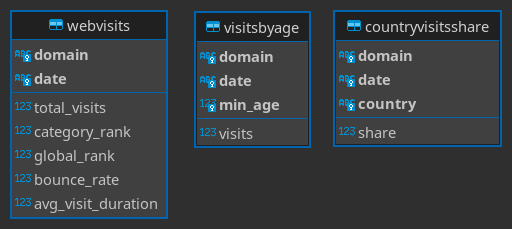
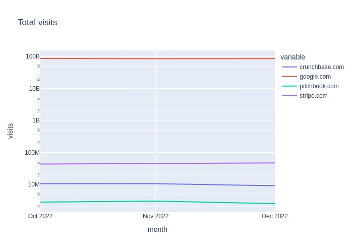
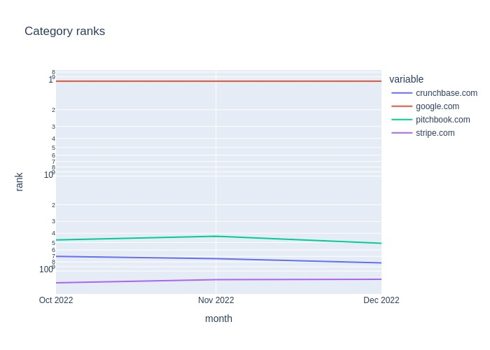
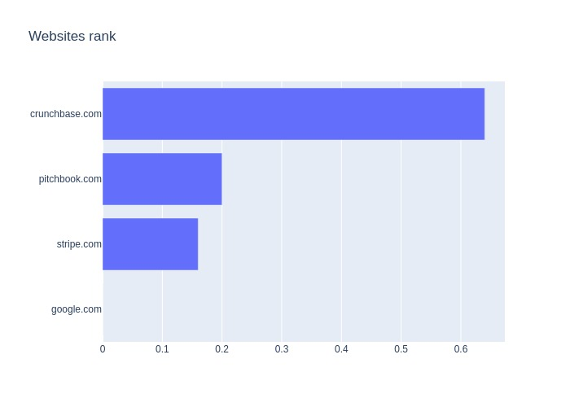

# SWeb

[](https://github.com/91nunocosta/python-package-cookiecutter/releases/tag/v0.10.1)


[](https://github.com/91nunocosta/sweb)

Proof of Concept (PoC) for a data pipeline with the following steps:

1. Extract website visits stats from a collection of [Similarweb](https://www.similarweb.com)
pages HTML files into a CSV file.
2. Load the CSV file into a normalized SQLite database file.
3. Analyse the website visits:
   1. plot website visits growth in a lines chart.
   2. plot website category ranks growth in a lines chart.
   3. plot website trend rank on a bars chart.

The PoC includes the following elements:

- [sweb](./sweb/): a Python package that implements all the steps and the workflow script.
- [tests](./tests/): unit tests covering _sweb_ module.
- [source_html](./source_html/): _Similarweb_ HTML pages that the PoC uses as input.
- [results](./results/): the pipeline outputs mentioned in [Results](#results) section.

## Results

Running the [_sweb_ workflow](./sweb/workflow.py) with default input,
[_source_html_ directory](./source_html/), produces the outputs that the following
subsections describe.

### CSV table

The file [results/webvisits.csv](./results/webvisits.csv) is a CSV with the raw
string values extracted from the HTML files in [source_html](./source_html/).
It includes the following columns with string values.

- `domain`: website URL's domain.
- `date`: the stats' year and month.
- `global_rank`: the `domain`'s _global rank_ during the `date`'s month.
- `total_visits`: the _total number of visits_ to `the domain` during the `date`'s month.
- `bounce_rate`: the _bouce rate_ of visits to the `domain` during the `date`'s month.
- `avg_visit_duration`: the average duration of visits to the `domain`
during the `date`'s month.
- `past_category_ranks`: the `domain`'s _category ranks_ for 2 months before the `date`
and the `date`'s month.
- `past_total_visits`: the `domain`'s _total visits_ for 2 months before the `date` and
the `date`'s month.
- `top_countries`:  the _top visitor countries_, and their share, to `domain`
during `date`'s month.
- `age_distribution`:  the _age distribution of visits_ to `domain` during `date`'s month.

### SQLite database

The file [results/webvisits.db](./results/webvisits.db) is a _SQLite_ normalized relational
database with the following schema:



The schema satisfies the following properties:

1. It is suitable for monthly web crawling of Similarweb.
Each month the workflow would insert a new row per website in each of the 3 tables.
In such a scenario, the workflow wouldn't extract past stats
(_visits_, _category ranks_, etc).
2. Considering the monthly web crawling scenario, it is [third normal form](https://en.wikipedia.org/wiki/Third_normal_form).
Some `webvisits`' fields are nullable because we don't have past data for such fields.
Yet, in the monthly execution scenario, that would not be the case.

### Charts

The workflow produces the following charts.

#### Visits growth



#### Category rank growth



#### Websites rank



## Execution

To execute the workflow on your machine, follow these steps:

1. Clone the repository.

   ```bash
   git clone git@github.com:91nunocosta/sweb.git
   ```

2. Open the project directory.

   ```bash
    cd sweb
   ```

3. Install [_poetry_](https://python-poetry.org/) _package and dependency manager_.
Follow the [poetry installation guide](https://python-poetry.org/docs/#installation).
Chose the method that is more convenient to you, for example:

   ```bash
   curl -sSL\
      https://raw.githubusercontent.com/python-poetry/poetry/master/get-poetry.py \
      | python -
   ```

4. Create a new virtual environment (managed by _poetry_) with the project dependencies.

   ```bash
   poetry install
   ```

5. Run the workflow.

   ```bash
   poetry run sweb
   ```

## Development

### Linting

We lint the PoC with the [pre-comit](https://pre-commit.com/) setup that [.pre-commit-config.yaml](./.pre-commit-config.yaml)
defines.

After executing steps 1. to 4. above, you can run the linters as follows:

1. Install linting dependencies:

   ```bash
   poetry install --with=lint --with=test
   ```

2. Run pre-commit:

   ```bash
   poetry run pre-commit run --all-files
   ```

### Testing

We test the PoC with the [tox](https://tox.wiki/en/latest/) that [tox.ini](./tox.ini) defines.

After executing steps 1. to 4. above you can run the test as following:

1. Install Continuous Delivery dependencies:

   ```bash
   poetry install --with=cd
   ```

2. Run tox:

   ```bash
   poetry run tox
   ```

### Continuous Integration

We configured GitHub Actions to execute the lining and tests on push actions.

You can see their execution [here](https://github.com/91nunocosta/sweb/actions).
